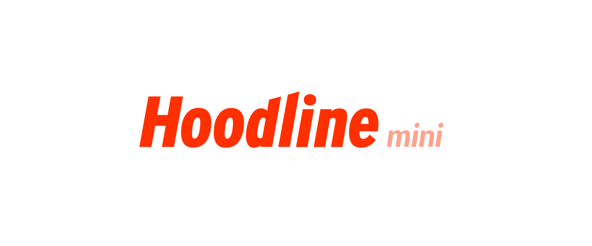

## Hoodline Mini

MacOS menu bar notification app for Hoodline built on [Electron](https://electron.atom.io/).

👉 [Download latest release](/releases) 👈

***

### Neighborhood Support

Hoodline Mini supports all neighborhoods covered by Hoodline **except** those listed below. This is because these neighborhoods do not have a public XML feed with which to fetch story data from—at least not any that I can find.

**Not supported:**
* Bayview
* Dogpatch
* Glen Park
* Ingleside
* Inner Richmond
* Lower Nob Hill
* Marina
* Mission
* Nob Hill
* Noe Valley
* North Beach
* Outer Richmond
* Pacific Heights
* Potrero Hill
* Russian Hill
* Twin Peaks
* West Portal
* Western Addition

***

**Legal Junk**

Unless otherwise stated, all copy, images, and promotional content pulled from Hoodline are the property of Hoodline, Inc.

<small>Copyright &copy; 2016 [Nathan Buchar](mailto:hello@nathanbuchar.com)</small>
